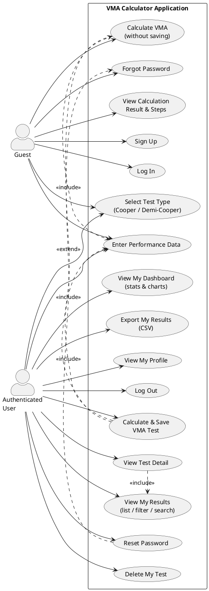
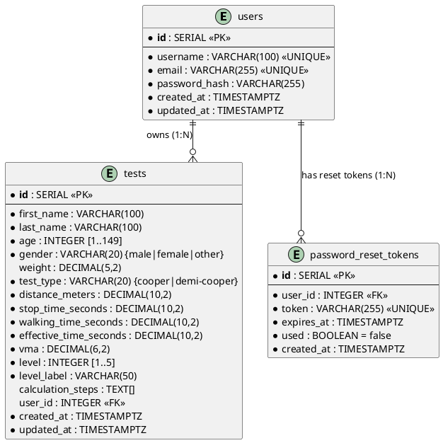
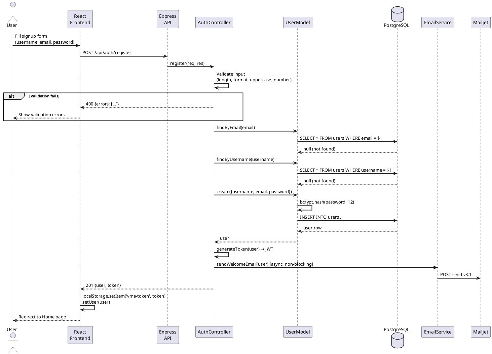
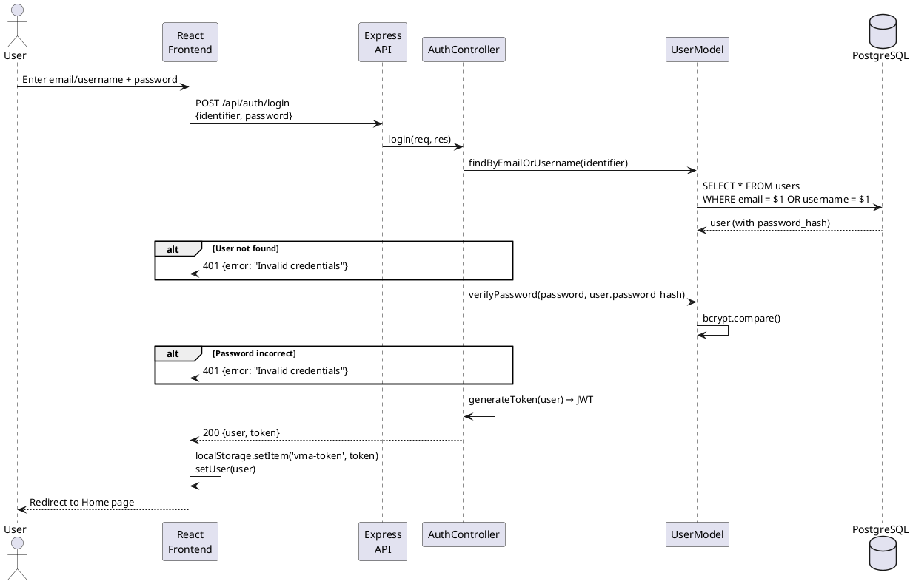
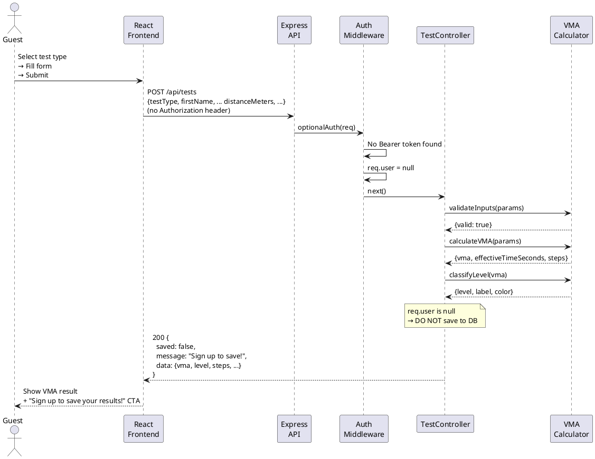
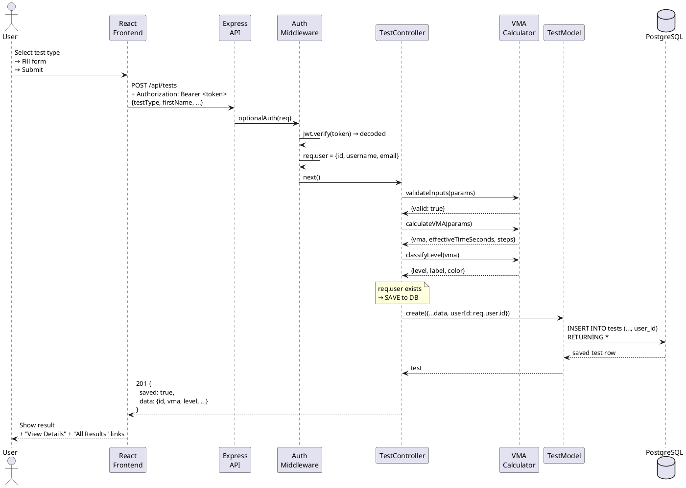
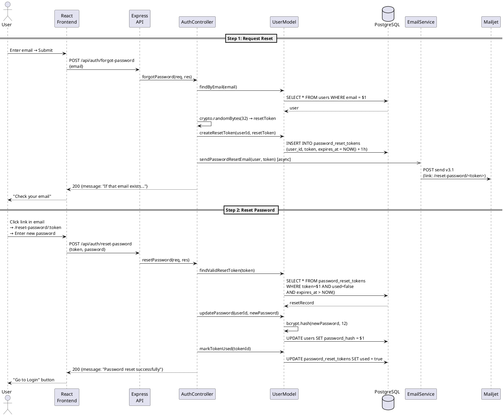
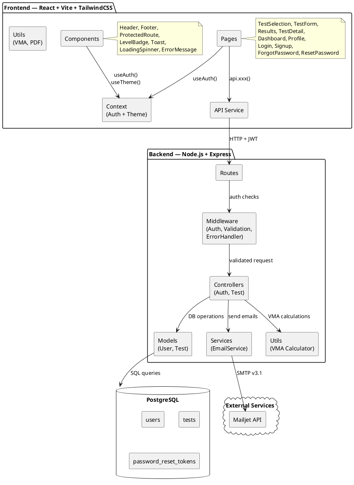
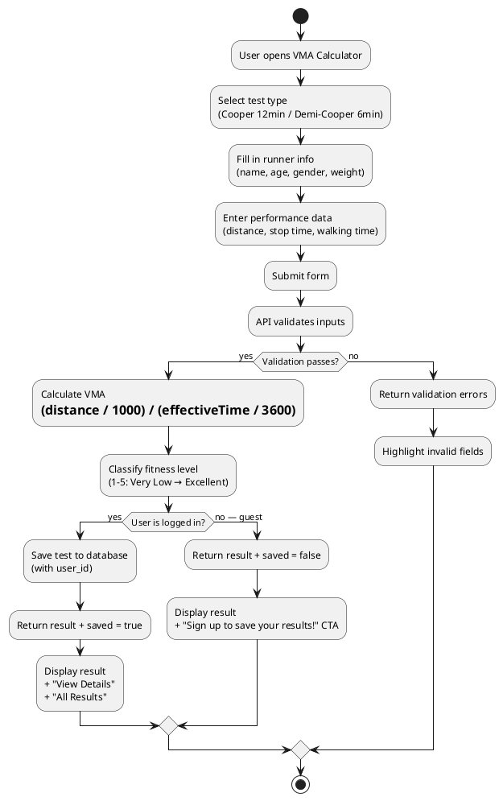

# VMA Calculator — UML Diagrams

> All diagrams below are written in **PlantUML** syntax. You can render them at
> [plantuml.com/plantuml](https://www.plantuml.com/plantuml/uml) or with the
> VS Code extension **"PlantUML"** (`jebbs.plantuml`).

---

## Table of Contents

1. [Use Case Diagram](#1-use-case-diagram)
2. [Class Diagram (Backend)](#2-class-diagram--backend)
3. [Entity-Relationship Diagram (Database)](#3-entity-relationship-diagram--database)
4. [Sequence Diagram — Register](#4-sequence-diagram--register)
5. [Sequence Diagram — Login](#5-sequence-diagram--login)
6. [Sequence Diagram — Guest VMA Calculation](#6-sequence-diagram--guest-vma-calculation)
7. [Sequence Diagram — Authenticated VMA Test (Save)](#7-sequence-diagram--authenticated-vma-test-save)
8. [Sequence Diagram — Password Reset](#8-sequence-diagram--password-reset)
9. [Component Diagram (Architecture)](#9-component-diagram--architecture)
10. [Activity Diagram — Test Flow](#10-activity-diagram--test-flow)

---

## 1. Use Case Diagram



---

## 2. Class Diagram (Backend)

```plantuml
@startuml ClassDiagram
skinparam classAttributeIconSize 0
skinparam class {
  BackgroundColor #f8fafc
  BorderColor #334155
  ArrowColor #334155
}

package "Models" {
  class UserModel {
    +createTable(): Promise<void>
    +create(username, email, password): Promise<User>
    +findByEmail(email): Promise<User|null>
    +findByUsername(username): Promise<User|null>
    +findByEmailOrUsername(identifier): Promise<User|null>
    +findById(id): Promise<User|null>
    +verifyPassword(plain, hash): Promise<boolean>
    +updatePassword(userId, newPassword): Promise<void>
    +createResetToken(userId, token): Promise<void>
    +findValidResetToken(token): Promise<ResetToken|null>
    +markTokenUsed(tokenId): Promise<void>
  }

  class TestModel {
    +createTable(): Promise<void>
    +create(data): Promise<Test>
    +findAll(filters): Promise<Test[]>
    +findByUserId(userId, filters): Promise<Test[]>
    +findById(id): Promise<Test|null>
    +delete(id): Promise<Test|null>
    +count(filters): Promise<number>
    +countByUserId(userId, filters): Promise<number>
    +getStats(): Promise<Stats>
    +getStatsByUserId(userId): Promise<Stats>
    +findAllForExport(filters): Promise<Test[]>
  }
}

package "Controllers" {
  class AuthController {
    +register(req, res, next): Promise<void>
    +login(req, res, next): Promise<void>
    +logout(req, res): void
    +me(req, res, next): Promise<void>
    +forgotPassword(req, res, next): Promise<void>
    +resetPassword(req, res, next): Promise<void>
  }

  class TestController {
    +create(req, res, next): Promise<void>
    +getAll(req, res, next): Promise<void>
    +getById(req, res, next): Promise<void>
    +delete(req, res, next): Promise<void>
    +exportCSV(req, res, next): Promise<void>
    +getStats(req, res, next): Promise<void>
    +getUserTests(req, res, next): Promise<void>
  }
}

package "Middleware" {
  class Auth {
    +generateToken(user): string
    +requireAuth(req, res, next): void
    +optionalAuth(req, res, next): void
  }

  class Validation {
    +validateTestInput(req, res, next): void
  }

  class ErrorHandler {
    +errorHandler(err, req, res, next): void
    +notFound(req, res, next): void
  }
}

package "Services" {
  class EmailService {
    -getClient(): MailjetClient|null
    +sendEmail(options): Promise<result>
    +sendWelcomeEmail(user): Promise<void>
    +sendPasswordResetEmail(user, token): Promise<void>
  }
}

package "Utils" {
  class VMACalculator {
    +TEST_DURATIONS: {cooper: 720, demi-cooper: 360}
    +validateInputs(params): {valid, errors}
    +calculateVMA(params): {vma, effectiveTimeSeconds, steps}
    +classifyLevel(vma): {level, label, color}
    +validateForm(data): {valid, errors}
  }
}

package "Config" {
  class Database {
    +pool: pg.Pool
  }
}

' ── Relationships ──
AuthController --> UserModel : uses
AuthController --> Auth : uses generateToken
AuthController --> EmailService : sends emails
TestController --> TestModel : uses
TestController --> VMACalculator : calculates VMA
TestController --> Auth : requireAuth / optionalAuth
UserModel --> Database : queries
TestModel --> Database : queries
EmailService --> "Mailjet API" : sends via

@enduml
```



---

## 3. Entity-Relationship Diagram (Database)



---

## 4. Sequence Diagram — Register



---

## 5. Sequence Diagram — Login



---

## 6. Sequence Diagram — Guest VMA Calculation



---

## 7. Sequence Diagram — Authenticated VMA Test (Save)



---

## 8. Sequence Diagram — Password Reset



---

## 9. Component Diagram (Architecture)



---

## 10. Activity Diagram — Test Flow



---

## How to Render These Diagrams

### Option 1: VS Code Extension
1. Install the **PlantUML** extension (`jebbs.plantuml`)
2. Open this `.md` file
3. Place your cursor inside a `plantuml` code block
4. Press `Alt+D` to preview

### Option 2: Online
1. Go to **https://www.plantuml.com/plantuml/uml**
2. Paste any `@startuml ... @enduml` block
3. Click "Submit" to render

### Option 3: Export to PNG/SVG
```bash
# Install PlantUML (requires Java)
sudo apt install plantuml

# Render all diagrams from this file
plantuml -tpng docs/UML.md     # generates PNG images
plantuml -tsvg docs/UML.md     # generates SVG images
```

---

*VMA Calculator — Developed by Maryam Karim*
*© 2026*
